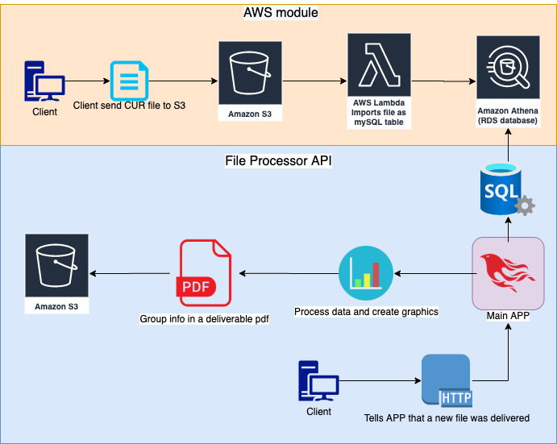

# This project was not finishied and may never be. :( 

# AWSBillingOptimizer (ABO)
*Author: Lucas Campos Tavano*

Final paper of the Computer Engineering course at the Federal Technological University of Paraná (UTFPR)

## Description
This project's goal is to create a system to analyze AWS Cost and Usage Report (CUR), processing it and creating an
output to help Cloud engineers to optimize his AWS costs

## Main diagram

